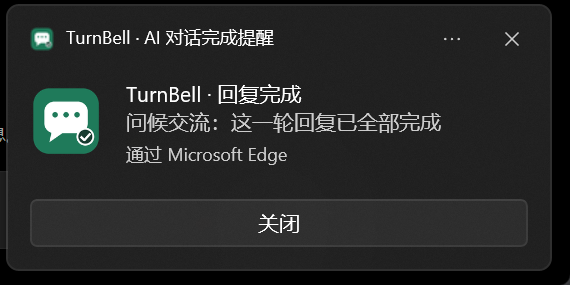
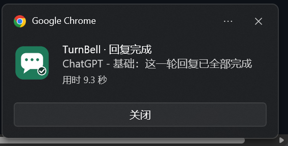
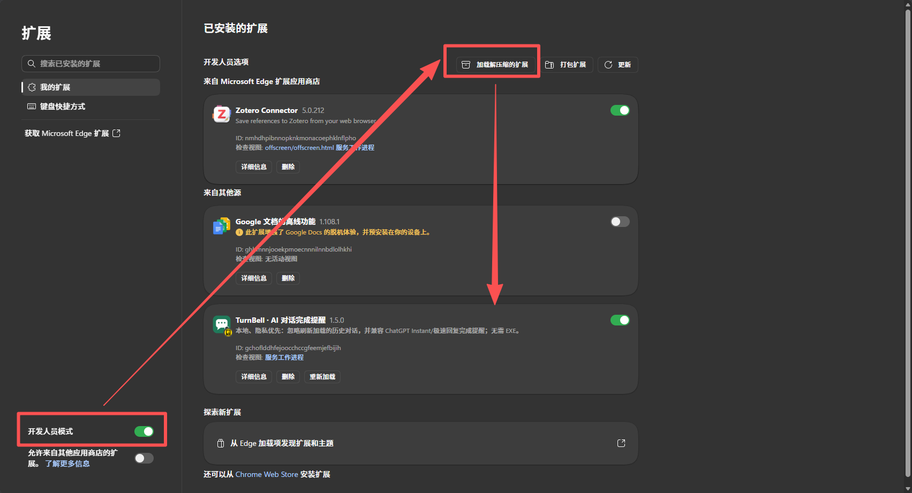
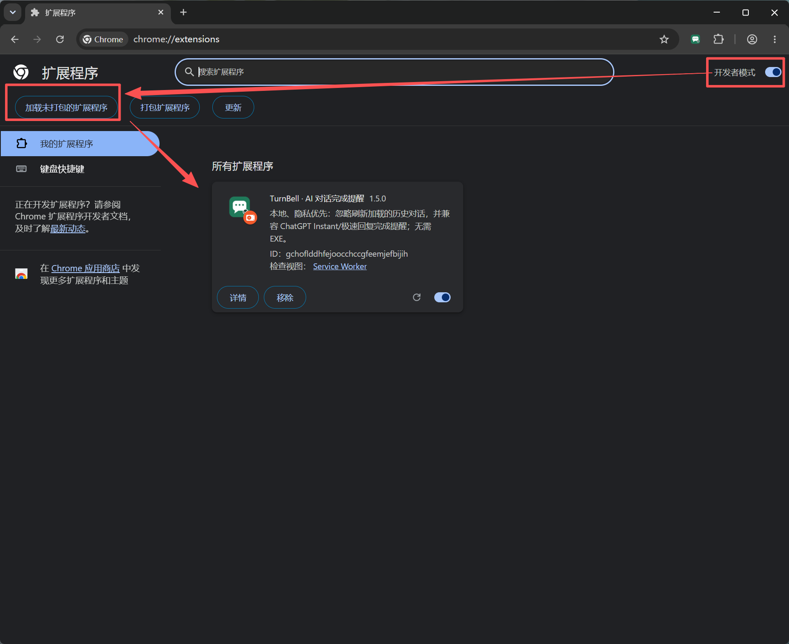
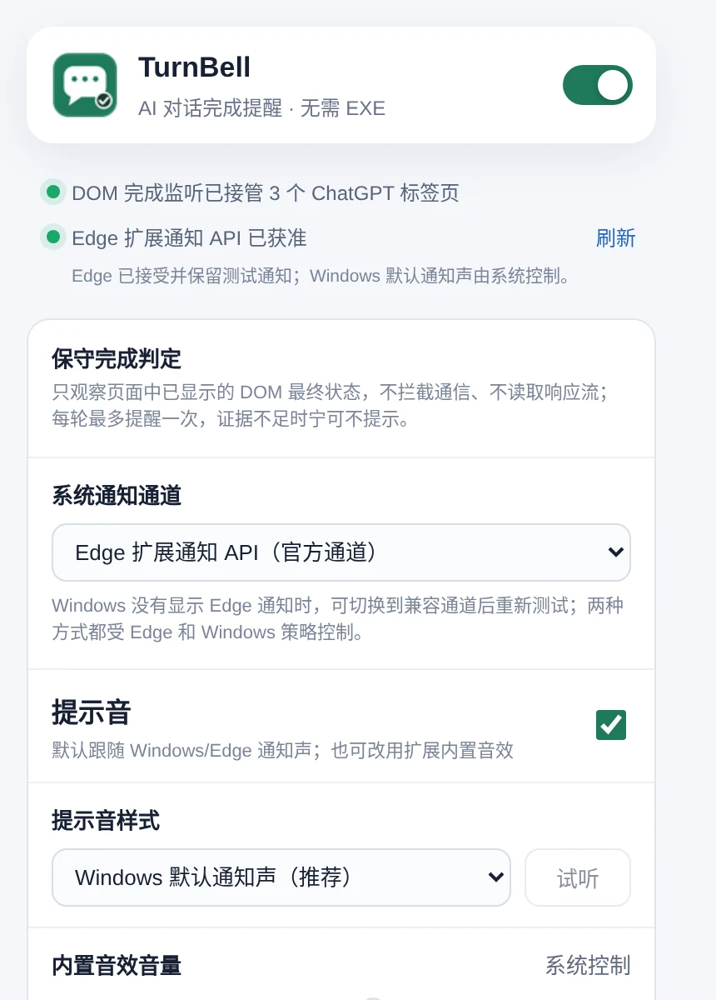
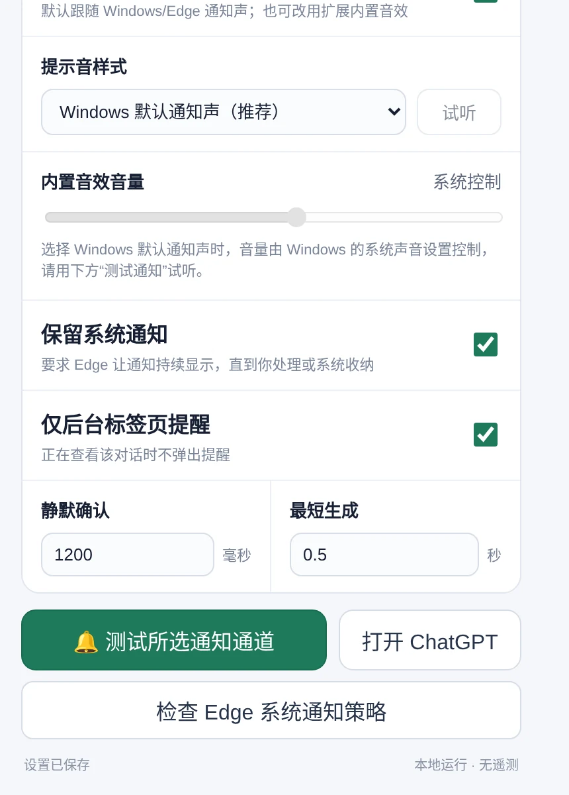

# TurnBell

TurnBell 是一个本地、隐私优先的 Chromium 扩展：当 ChatGPT 的一轮新回复真正完成后，通过浏览器的系统通知通道提醒，并在工具栏显示完成徽标。Windows 使用系统通知；macOS 上的 Chrome 扩展通知由 macOS 通知中心显示。

**无需 EXE、原生辅助程序或本地端口，不更换浏览器配置，不读取 Cookie，不上传对话。**

> 当前版本：**1.6.1**
> 1.6.1 改进了 macOS / Edge 后台回复完成检测。系统通知通道已在 macOS Edge 上确认可接受测试通知；真实回复完成后的横幅仍需持续实机观察。

<p align="center">
  
</p>

<p align="center">
  
</p>

## 功能

- 支持普通回答以及 ChatGPT Instant / “极速”回复。
- 切换到其他 Edge 标签页或其他应用后仍可提醒。
- 锁屏期间完成的回复会在解锁后重新显示通知。
- 刷新已有对话时只建立历史基线，不为旧回答误发通知。
- 等待文本稳定与完成信号，减少推理摘要、搜索进度和工具状态的误报。
- 每个检测到的用户轮次最多提醒一次，抑制重复完成信号。
- 支持 Windows 系统通知和 macOS 通知中心。
- 系统默认通知声跟随操作系统和浏览器设置，也可使用五种本地提示音。
- 支持 Chromium 扩展通知 API 与 Web Notification 兼容通道。
- 全部处理在本机完成，无遥测、广告和远程 JavaScript。

## 快速安装

### 1. 下载并解压

在 GitHub 仓库页面点击绿色 **Code** 按钮，选择 **Download ZIP**，然后完整解压。若使用单独的系统版本包，按对应安装文档操作。

不要直接在压缩包预览窗口中加载扩展。

### 2. 打开浏览器扩展管理页

如果你使用 **Microsoft Edge**，在地址栏输入：

```text
edge://extensions/
```

如果你使用 **Google Chrome**，在地址栏输入：

```text
chrome://extensions/
```

### 3. 加载扩展

#### macOS 上的 Microsoft Edge 或 Google Chrome

1. 打开 `edge://extensions/` 或 `chrome://extensions/`；
2. 开启 **开发人员模式**；
3. 点击 **加载解压缩的扩展** / **加载未打包的扩展程序**；
4. 选择解压目录中的 `extension` 文件夹。macOS 版本包中它位于 `TurnBell-1.6.1-macOS/extension`。

详细步骤和 macOS 通知权限设置见 [INSTALL-MACOS.md](INSTALL-MACOS.md)。

#### Windows 上的 Microsoft Edge

1. 打开页面左下角的 **开发人员模式**；
2. 点击右上角的 **加载解压缩的扩展**；
3. 选择下载并解压后的 TurnBell 文件夹中的 `extension` 子文件夹。

<p align="center">
  
</p>

#### Windows 上的 Google Chrome

1. 打开页面右上角的 **开发者模式**；
2. 点击左上角的 **加载未打包的扩展程序**；
3. 选择下载并解压后的 TurnBell 文件夹中的 `extension` 子文件夹。

<p align="center">
  
</p>

### 4. 开始使用

1. 将 TurnBell 固定到浏览器工具栏；
2. 刷新已经打开的 ChatGPT 标签页；
3. 打开 TurnBell 弹窗；
4. 点击 **测试所选通知通道**；
5. 保持默认的系统通知声，或选择一个本地音效。

更新旧版本时，在对应浏览器的扩展管理页中点击 TurnBell 卡片上的 **重新加载**，然后刷新所有 ChatGPT 标签页。请确保只安装一个 TurnBell 实例，避免重复提醒。

## 设置界面

<p align="center">
  
  &nbsp;&nbsp;
  
</p>

主要设置包括：

- 系统通知通道；
- 系统默认通知声或内置音效；
- 保留系统通知；
- 仅后台标签页提醒；
- 静默确认时间；
- 最短生成时间。

## 平台支持与真实测试

目前已在 **Windows + Microsoft Edge** 与 **Windows + Google Chrome** 上进行了实机使用测试，并确认以下场景可用：

- 普通推理强度完成提醒；
- Instant / “极速”回复完成提醒；
- 切换到同一 Edge 窗口中的其他标签页；
- 切换到其他 Windows 应用；
- 刷新已有对话不提醒；
- 连续多轮对话分别提醒；
- Windows 系统通知；
- Chrome 扩展系统通知；
- Windows 系统默认通知声；
- 自定义本地音效；
- 每轮重复信号抑制。

1.6.1 中，macOS 的通知使用 Chromium `chrome.notifications` 扩展 API。Chrome 在 macOS 上会把该 API 的通知交给 macOS 原生通知系统；TurnBell 默认选择的正是这个通道。具体说明见 [Chrome 扩展通知文档](https://developer.chrome.com/blog/native-mac-os-notifications)。

尚未完成实机验证的环境包括：

- macOS 上真实回复完成后的通知横幅和声音；
- Linux；
- Brave、Vivaldi 等其他 Chromium 浏览器；
- InPrivate / Chrome 无痕模式；
- 受学校、公司或组织策略管理的 Edge / Chrome。

Manifest 采用 Chromium 扩展标准，但这不等于上述环境已经验证可用。

## 完成判定

TurnBell 不通过单一固定超时猜测所有回复完成。正常路径综合检查：

```text
新轮次被用户明确启动
  +
最新助手文本确实发生变化
  +
页面不再处于生成状态
  +
文本保持稳定
  +
最新回答出现最终操作控件
  ↓
后台按标签页与轮次去重后提醒
```

Instant / “极速”路径可能没有持续可见的生成状态或最终操作栏，因此仅对明确的实时发送动作启用更严格的兼容规则：回答必须相对发送前发生变化，并连续稳定约 3 秒。

1.6.1 增加了后台兼容路径：如果明确发送的回复曾出现生成状态，但后台页面没有呈现最终操作栏，文本连续稳定约 8 秒后也可提醒。若生成按钮消失后的推理摘要长时间不变，这条路径仍有误报可能。切回标签页时才首次看到完成状态，则不补发迟到提醒。

Edge 若休眠标签页，页面脚本会暂停；在不调整浏览器设置的前提下，纯 DOM 扩展无法保证休眠期间即时检测完成。

TurnBell 的语义是**每轮至多一次提醒**，不是严格的 exactly-once。若 Edge 丢弃标签页、ChatGPT 大幅修改页面结构或最终证据不足，扩展可能选择不提醒，而不是把中间过程误报为完成。

## 隐私与权限

TurnBell 只在扩展的 `ISOLATED` world 中观察页面已经显示的 DOM 状态。

它不会：

- 读取 Cookie、密码、令牌或账户凭据；
- 包装或替换 `fetch` / `XMLHttpRequest`；
- 拦截、克隆或解析 ChatGPT 响应流；
- 使用 `webRequest`；
- 自动发送问题或批量提取历史对话；
- 上传回答正文；
- 运行 EXE、本地服务或监听端口；
- 加载远程 JavaScript；
- 包含遥测、广告、混淆或反检测逻辑。

内容脚本会在当前页面进程中读取最新可见回答，用于判断文本是否继续变化，但回答正文不会发送给扩展后台、写入存储或上传。

权限用途：

```text
notifications  通过浏览器请求操作系统通知
storage        保存本地设置和短期去重状态
offscreen      仅在选择自定义音效时播放扩展包内 WAV
scripting      给更新前已打开的 ChatGPT 标签页补注入本地脚本
idle           判断系统空闲/锁屏状态，以便在恢复活动后补发完成通知
```

站点权限仅限：

```text
https://chatgpt.com/*
https://chat.openai.com/*
```

详细说明见 [PRIVACY.md](PRIVACY.md)。

## Windows 系统通知排障

若测试按钮显示浏览器已接受通知，但 Windows 没有显示横幅：

1. 按 `Win + N` 检查通知中心；
2. 检查 Windows“请勿打扰”；
3. 在 `edge://policy` 搜索 `AllowSystemNotifications`；
4. 尝试切换 TurnBell 的另一个通知通道；
5. 检查 Windows 音量混合器中的 Edge。

纯扩展不能绕过 Windows、浏览器或组织通知策略。Windows 排障见 [INSTALL-WINDOWS.md](INSTALL-WINDOWS.md)；macOS 排障见 [INSTALL-MACOS.md](INSTALL-MACOS.md)。

## 开发与测试

无需 npm 运行时依赖。测试需要 Node.js 和 Python 3：

```bash
node --test extension/tests/*.test.js
find extension -name '*.js' -print0 | xargs -0 -n1 node --check
python3 -m unittest discover -s scripts/tests -v
python3 -m py_compile scripts/*.py scripts/tests/*.py
./scripts/build-all.sh
```

源代码结构：

```text
extension/          可直接加载的 Manifest V3 扩展
extension/src/      检测、通知、调度与设置逻辑
extension/tests/    Node.js 自动化测试
scripts/            构建和发布校验脚本
docs/images/        README 使用的安装与界面图片
```

## 开源许可与项目身份

代码及 TurnBell 原创图标、内置音效采用 [MIT License](LICENSE)。第三方名称、商标和文档截图说明见 [THIRD_PARTY_NOTICES.md](THIRD_PARTY_NOTICES.md)。

TurnBell 是非官方独立项目，与 OpenAI、Microsoft、Google 或 Apple 无隶属、赞助、认证或合作关系。`ChatGPT`、`Microsoft Edge`、`Google Chrome`、`Windows` 和 `macOS` 等名称仅用于说明兼容对象或界面，相关商标归各自权利人所有。
